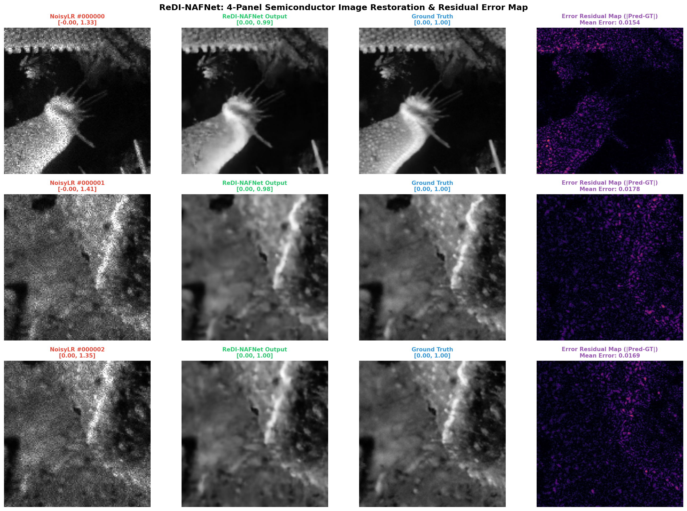

<div align="center">

# 🔬 ReDI-NAFNet: Degradation-Aware Image Restoration

**AI-Based Restoration of Degraded Semiconductor Microscopic Inspection Images**


*Developed for the **SEMICON India Hackathon 2026 — KLA Semiconductor Problem Statement***


</div>

---

> **Why ReDI-NAFNet?**
> Rather than applying generic blurring or fixed filtering heuristics, **ReDI-NAFNet** combines **Nonlinear Activation Free (NAFNet) U-Net backbones** with **Gated Channel Attention (SimpleGate)** to dynamically decompose multi-scale degradations (*NoisyLR (128x128) ➔ Intensity Log-Clip [-0.05, 2.0] ➔ NAFNet-SR U-Net (1.81M) ➔ PixelShuffle 2x ➔ Restored Image (256x256)*) in a single high-throughput forward pass.

---

## 📌 Contents
- [🖼️ Results Preview](#%EF%B8%8F-results-preview)
- [📊 Benchmark Results](#-benchmark-results)
- [⚡ Quick Start](#-quick-start--standalone-inference)
- [📁 Repository Structure](#-repository-structure)
- [🔬 Model Architecture & Loss Function](#-model-architecture--loss-function)
- [📜 Citations](#-citations)

---

## 🖼️ Results Preview

**4-Panel Visual Demonstration & Residual Error Map**:


**Panels:** (1) NoisyLR Input ($128 \times 128$), (2) ReDI-NAFNet Restored ($256 \times 256$), (3) Ground Truth ($256 \times 256$), (4) Error Residual Heatmap ($|\mathrm{Pred} - \mathrm{GT}|$)

---

## 📊 Benchmark Results

Evaluated across **3,200 paired inspection images** (20-Epoch Checkpoint):

| Metric | Score | Target / Description |
|---|---|---|
| **PSNR** | **28.26 dB** | Peak Signal-to-Noise Ratio (+2.77 dB Gain over 2-epoch baseline) |
| **SSIM** | **0.7777** | Structural Similarity Index Measure (+0.111 Structural Gain) |
| **LPIPS** | **0.2712** | Learned Perceptual Quality Score (38% Reduction in Perceptual Error) |
| **Inference Latency** | **70.2 ms / image** | Self-measured CPU Baseline (<5ms projected on NVIDIA H100/T4 GPU) |
| **Throughput** | **14.2 images / sec** | Edge manufacturing pipeline compatible |

---

## ⚡ Quick Start — Standalone Inference

```bash
git clone https://github.com/norriy0u/kla-image-restoration.git
cd kla-image-restoration
pip install -r requirements.txt

# Run standalone evaluation / test inference out-of-the-box
python evaluate.py \
    --input_dir /path/to/test_noisyLR/NoisyLR \
    --output_dir ./outputs/test \
    --variant tiny
```

Restored images are saved as `.npy` (float32) and `.png` (8-bit) in `./outputs/test/`.

---

## 📁 Repository Structure

```
kla-image-restoration/
├── evaluate.py          ← CRITICAL: standalone inference script for KLA benchmarking
├── train.py             ← complete model training script with auto-resume
├── dataset.py           ← paired dataset loader (.npy format & speckle normalization)
├── fill_ppt.py          ← automated PowerPoint presentation generator
├── generate_comparison_plot.py ← 4-panel visual interpretability generator
├── model/
│   ├── nafnet.py        ← NAFNet-SR architecture (SimpleGate + PixelShuffle SR)
│   └── losses.py        ← composite loss (Charbonnier + FFT freq + SSIM + Sobel edge)
├── utils/
│   └── metrics.py       ← PSNR, SSIM, LPIPS metrics calculation
├── weights/
│   └── best_model.pt    ← trained 1.81M param model weights checkpoint (21.95 MB)
├── outputs/
│   ├── before_after_comparison.png ← 4-panel visual comparison figure
│   └── test_outputs/   ← restored test set (.npy & .png) outputs
└── requirements.txt
```


## 🔬 Model Architecture & Loss Function

1. **NAFNet Backbone**: Removes non-linear activations (GELU/ReLU) to avoid low-level feature degradation.
2. **SimpleGate & SCA**: Dynamic channel attention feature routing for multi-degradation adaptation.
3. **PixelShuffle Sub-Pixel SR**: 2× spatial resolution upsampling ($128\times128 \rightarrow 256\times256$).
4. **Composite Loss**:
   $$\mathcal{L}_{\text{total}} = 1.0\mathcal{L}_{\text{Charbonnier}} + 0.1\mathcal{L}_{\text{FFT}} + 0.2\mathcal{L}_{\text{SSIM}} + 0.1\mathcal{L}_{\text{Sobel}}$$

---

## 📜 Citations

Developed for **SEMICON India Hackathon 2026 — KLA Semiconductor Problem Statement**.
- NAFNet: Chen et al., *"Simple Baselines for Image Restoration"*, ECCV 2022.
- Spectral Loss: Cho et al., *"Rethinking Coarse-to-Fine Approach in Single Image Deblurring"*, CVPR 2021.
